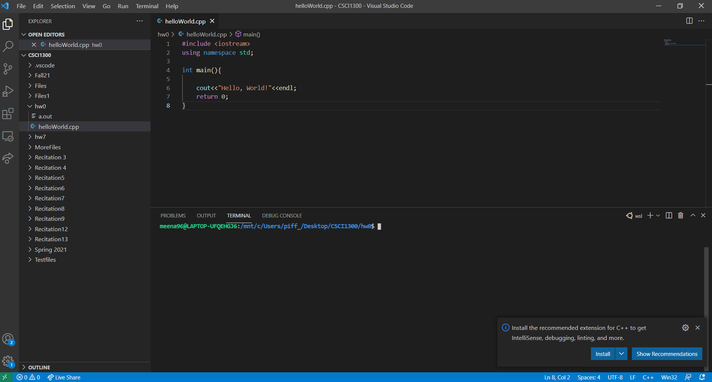
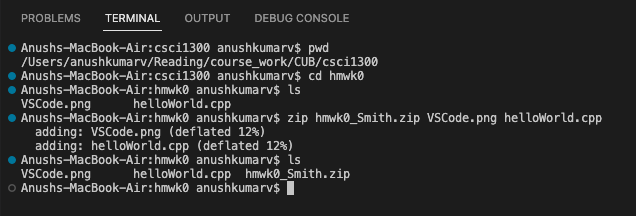
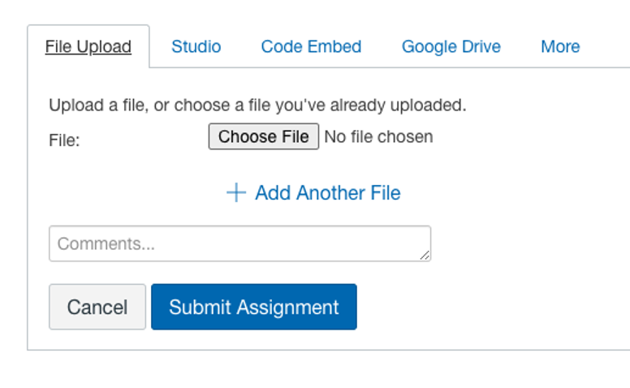

#### **CSCI 1300 CS1: Starting Computing: Homework 0**
#### **Hoenigman/Naidu/Park/Ramesh - Fall 2023**
#### **Due: Friday, September 1 by 5:00pm MST**

Zip file submission must be completed and submitted by Friday, September 1 by 5pm to recieve credit. 

# Table of contents

1. [Objectives](#objectives)
2. [Submission Instructions](#submit)
3. [Grading rubric](#grading)

# Objectives 

1. [Set up VSCode](#setup)
2. [Learn essential terminal commands and write your first C++ program](#introduction)

## 1. Setup VSCode 
In recitation, you will be getting started with Visual Studio Code (VS Code), a local development environment we’ll use throughout the semester. Follow the steps below. If you need help, ask your TA or one of the LAs (You can post on **Edstem** as well, our class discussion forum).

You can find the guide to setup VSCode for the operating system you use under [guides folder in GitHub](guides). Additionally, you can also relevant links to it on Canvas under the assignment "Homework 0".

## 2. Learn how to use Terminal and write your first C++ program
Please follow the appropriate guide below, based on your operating system.
* [MAC/Linux](introduction/mac_or_linux.md)
* [Windows](introduction/windows.md)

# Submission Instructions 

### Screenshot
We would like to make sure that you are comfortable working with VS Code. Take a screenshot of the window for VSCode, and name it VSCode.png (or VSCode.jpg). This screenshot can be of VS Code in your local installation of VS Code.`VSCode.png` (or `VSCode.jpg`).

### Zip your submission file

Copy your `helloWorld.cpp` file and put it in the same folder as where your took your screenshot and create a zip file with **both your screenshot and your cpp file**. If your last name is Smith, then the name of the zip file should be `hmwk0_Smith.zip`.

Note: Ensure that your folder contains only the screenshot and `helloWorld.cpp` file before you compress your folder. See the screenshot below for reference.

Additionally, you may also choose to compress your files via GUI. Please refer to the below links for reference.
* [Windows](https://support.microsoft.com/en-us/windows/zip-and-unzip-files-8d28fa72-f2f9-712f-67df-f80cf89fd4e5)
* [Mac](https://support.apple.com/guide/mac-help/zip-and-unzip-files-and-folders-on-mac-mchlp2528/mac)

### Submit to Canvas
Once you download the zip file, go to Homework 0 on Canvas, click “add submission”. Use the “choose file” option to upload your zip file and click “submit assignment”. You can add comments as well, if you need to convey something with respect to the current HW.

---
   

# Grading Rubric 
| **Criteria**                                                | **Pts** |
| ----------------------------------------------------------- | ------- |
| Zip file submission with .cpp and .png files inside         | 10      |
| Recitation attendance (the week of August 28th)*            | -1      |
| Total                                                       | 10      |

**Note:** if your attendance is not recorded, you will lose points as mentioned in the above table. Make sure your attendance is recorded. 
