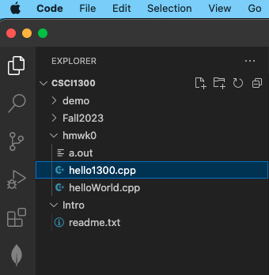

In this guide we will get to
1. [Learn essential terminal commands](#terminal)
2. [Write our first C++ program](#firstprogram)
3. [Learn advanced terminal commands](#advancedterminal)

## 1. Learn Essential Terminal Commands (Mac/Linux) <a name="terminal"></a>
In Visual Studio Code, you can open an integrated terminal. But what is a terminal?

A **terminal** is a text-based **interface** that allows you to interact with your computer. It provides a way to execute tasks, navigate through files and directories, install software, and other functionality. 

1. First, open VSCode.


2. In VSCode, click on Open Folder and select the folder you wish to have your program file in if not open yet. 

In this case, the folder name selected is csci1300, but it may look different for you. You might browse through your system a bit to find the folder, otherwise create a new folder wherever you like.


To open a the Terminal tab, go to the menu bar, locate Terminal and click on it. Select "New Terminal" to open a new terminal. A terminal looks like a dark screen when you open it and will open below the screen. 


You will see your name and your device name on the terminal tab. Note that this can look different depending on your OS. 

It can look something like this:


In general
1. Everything before the `:` tells you the username and the device name you’re logged in
2. Everything between the `:` and `$` is your current directory (think of a directory as the folder you’re in). Note that you do not need to be in the same directory as the screenshots shown above. Yours will depend on your computer.
    1. In the lastest OS version of Mac, as seen in the screenshot above, we see only the device name before the `:` and current directory and username in between `:` and `$`
    2. In some systems, it also common to see `~`.  `~` is shorthand for the current user's home directory.
3. `$` represents the end of the prompt, after which you can enter a command.

File browsing using the terminal is like using Finder/Explorer or clicking on folders and navigating to different folders on your machine.

In the terminal, instead of clicking on folders we use text commands to tell the computer what we want. If we want to go to a folder where we saved our last homework, we can type the commands to navigate to that folder and display its contents.

### Try these commands
```
ls -- list directory contents
```

`ls` = (that’s a lowercase “L”, not an uppercase “i”) stands for list and is used to ‘list’ or show you everything in the current directory.

Note:  after you type the command and press ENTER, a list of files and directories in your current directory is displayed as a result of the command.


---


```
mkdir -- make directories
```

To create a new directory, use the command `mkdir <my_folder>`
Note: Spaces are troublesome on the command line, so typically programmers use one of the following conventions:
camelCase: After the first word, each first letter is capitalized.
PascalCase: Similar to camelCase, but the first letter is also capitalized. 
underscores: Each word is separated by an underscore, for example: camelCase_is_different_from_PascalCase.  

Let’s create a directory named demo

`$ mkdir demo`

`demo` is now a directory/folder, nested under the csci1300 directory. If you list the contents of the folder, you will now notice a new item: `demo`.


You will also notice a new folder in the explorer tab, to the left of your window:


---


```
cd -- change the shell working directory
```

`cd` = stands for change directory. It is just like changing folders. It means, take me to place X. Commonly used as `cd <name_of_directory>`. 
* Note that there will always be a space between cd and the name of the directory that you want to navigate to.
* Note: cd takes you places in reference to your current location. It’s like going into a folder, and then clicking on a folder within that folder, and then clicking on another folder within that folder. You will always navigate deeper within that folder. To back up, we use `cd ..` (explained in a little bit).
* Note: You can also use cd with an absolute file path instead of relative paths. For example: `cd /bin` to switch to a common place where applications are stored (on linux). 
* Note: `cd ~` is a very helpful command that will reset your terminal to your user's home directory. 
* Note: cd (and other commands) is case sensitive. `demo` does not equal `Demo`. Make sure you type in directory names exactly as they are spelled.
The command `cd ..` means go to the parent of my current location. It’s essentially backing up.


## 2. Create a Hello World program <a name="firstprogram"></a>
The "Hello, World!" program is one of the simplest programs in a programming language, and it is often used to illustrate the basic syntax of a programming language. We will need to first create a folder to store our program file in and then create the file to write the program. 

1. After you open VSCode as illustrated in Section 2, you will see your new csci1300 folder on the left hand side of your screen.

2. We now need to create a new folder within the `csci1300` folder we just opened, called `hmwk0`. Click on your `csci1300` folder. Find the "create folder" button you used previously and click on it.

Note that you need to have your csci1300 folder selected so that we can put our hmwk0 folder inside of the csci1300 folder.


3. An entry opens up. Type `hwmk0` as shown.


4. We now need to create our program file under `hmwk0` folder. Select `hmwk0` folder from explorer tab. From the menu bar, choose File -> New File. Note that folder `hmwk0` is selected before we create


5. Save your file. Important: The filename should be named with lower *camelCase* (the first letter of the word in a compound word is lowercase and the first letter of subsequent words are capitalized) and end with .cpp. 
Your file name should be `helloWorld.cpp`.


6. Type the following code into your file.
```cpp
#include <iostream>

int main() {
    std::cout << "Hello, world!" << std::endl;
    return 0;
}
```


7. **Save** your file, then run your program through the terminal as mentioned below. A quick shortcut to save is **Cmd + S** (In Mac) or **Ctrl + S** (in Linux)

---

### Running a program in terminal
When you open VSCode, at the bottom of the screen you should see a terminal. If not, you can open a terminal by opening the Terminal menu on the top menu bar and selecting “New Terminal”.


In order to compile and run your code you first need to navigate to the directory where your code is saved. When you have a folder open in VSCode by default the terminal will open to the location of that folder. If your terminal is not open, refer to the Terminal section above.

You can visualize your location using `pwd` (print working directory).


Let’s say that the code you want to run is located in folder `hmwk0` as follows (it can differ for your system!).


As you can see, we’re currently in the `csci1300` directory (on your system, it will be the directory you opened earlier). Remember, that the current directory will be mentioned after the `:` symbol.

Our helloWorld file is under the `hmwk0` subdirectory. If it’s not, make sure it’s moved to the `hmwk0` directory. You can see the same using the `ls` command you saw before.


Navigate to hmwk0 using the `cd` command we saw before (i.e. run `cd hmwk0`, as in the screenshot below). We can verify we’re in the correct directory using `ls` again.


Now to compile our code we use the program g++ in the following command.
```
g++ -Wall -Werror -Wpedantic -std=c++17 helloWorld.cpp 
```

`g++` is the compiler program

`-std=c++17` specifies the version of C++ we want to use

`-Wall -Werror -Wpedantic` prevent our code from compiling if it violates ISO C++ rules. Any compilation warning will also be turned into errors

`helloWorld.cpp` is the file we want to compile


This command creates a file named `a.out` which is the compiled version of the code in `helloWorld.cpp`, which can be executed. Now to execute our code we run `a.out` by typing the following and hitting enter.

`./a.out`


If you get the output as the above, you’ve successfully run the program! And that is how you compile and run a C++ program from a terminal.

---

8. Let’s modify our program a bit. Add a statement to use the [standard namespace](https://www.tutorialspoint.com/cplusplus/cpp_namespaces.htm). Insert `using namespace std;` at the beginning of the code, then we can remove the `std::` prefixes. Run the program again using the steps above.

Note: Every time you make changes to the program, you need to follow the steps from **Running a program in terminal**. You do not need to do this after every change, you can cumulatively do this.


9. Let’s modify the file to print “Hello world! Hello CSCi 1300”. The text inside of the quotation marks is printed as it is. It’s case sensitive too! To see the updated output, compile and run again.


Congratulations! You’ve implemented your first C++ program! 

You will learn more C++ syntax over the semester to build your programming and problem-solving skills. Here is a snapshot of your program (from the class textbook: Brief C++: Late Objects, Enhanced eText; we recommend you check it out!). 


## 3. Advanced Terminal commands <a name="advancedterminal"></a>
Now that you’ve learnt the basic commands, here are some additional commands you can try out:

```
cp -- copy files
```
(**Note** Be very careful not to overwrite a file when moving or copying files! If you move or copy a file to a name that already exists, the existing file is destroyed!)
1. First, click inside the explorer tab, click on the file `helloWorld.cpp`. It will be under the folder `hmwk0`. Go up to the menu and choose File -> Save As and, when the dialog box opens, change the name of the file to `hello1300.cpp`. Choose `hmwk0`  as the destination folder.


2. Once you click Save, the new file will appear in the explorer tab, to the left side of the window.




3. Let’s make another directory named `hmwk1`. Make sure you are in your csci1300 folder when you run this command.
```
$ mkdir hmwk1
```

4. Now we want to copy the file from `hmwk0` into `hmwk1`. First, we go into the `hmwk0` directory:
```
$ cd hmwk0
```

5. Ok, now we use the command for copying files:
```
$ cp hello1300.cpp hello1300v2.cpp
```

6. Now let’s type `ls` and see what we have:


Since we did not specify the path for the file we wanted to copy, nor for where we want it copied, we now have an identical copy of the file, both of them inside the folder `hmwk0`.

7. Let’s do this again, including the path:
```
$ cp hello1300.cpp ../hmwk1/hello1300v3.cpp
```
Notice that our file explorer is also updating, to give us a visual idea of where our files are. The indentation represents which files are inside of what folders.


8. If your terminal window is full, you can always `clear` it. You can type the command “clear” OR right-click anywhere within the terminal, and choose “Clear”. 


---


```
mv -- move files
```
It’s possible to move files around using the command `mv`.  Starting in directory `hmwk0`, type:
```
$ mv hello1300.cpp ..
```

Remember, two dots indicate the parent directory (one level up).  Now if we list the files in `hmwk0`, there is only `hello1300v2.cpp` left. And we have moved the file `hello1300.cpp` up in the root directory:


Let’s move one more file into the `hmwk1` directory:


---


### zip (unzip) - package and compress (archive) files


An important thing to know for this class is how to `zip` your solution files into one assignment submission file. To create a `zip` file in Mac, please follow the [here](https://support.apple.com/guide/mac-help/zip-and-unzip-files-and-folders-on-mac-mchlp2528/mac). Additionally, we can also create a zip file via the terminal.


To do this, there’s a convenient command called `zip`.  Let’s `zip` up the two files in the directory `hmwk1` into a single zip file named `testFiles.zip`.

```
$ zip test_files.zip hello1300.cpp hello1300v3.cpp
```

The first argument is the name of the zip file we want to produce. The files listed next are the files that go into this zip file.  If you list your directory now, you should see three files.  Notice that the original files are still present--`zip` and `unzip` don’t destroy any files.


Let’s now move the .zip file from `hmwk1` into the `hmwk0` directory, and try to unzip the files:


You should see the three files in the directory.  Note that the original zip file didn’t get destroyed.

**NOTE**: This command may not be available on `coding.csel.io`. If this command is unavailable on your local machine then you can install it by using the terminal command:
```
sudo apt install zip
```
You will need to provide your password. Password characters are not displayed on the terminal. 

---

### Terminal commands we've learned
Here are the six useful terminal commands we just practiced:
* `clear`: Clear out your current terminal screen.
* `ls`: List directory contents. Use this command to see the list of files and folders in the current directory. 
* `mkdir`: Make directories. Create a new directory (folder). 
* `cd`: Change directory. Use this command to change the current directory (move to another folder) 
* `cp`: Copy a file 
* `mv`: Move a file 
* `zip`: Create a zip file 

### Fun tips and tricks
* Tab Complete: if you're typing something in the command line that’s very long, but unique, you can hit tab when you're partially through and it will try to fill in the rest (kind of like autocomplete). If it doesn't, and you press tab twice, it tells you everything it has as options.
* Command history browsing: if you have typed a command (e.g. `gedit myFile.txt`) and want to repeat it, just press the up arrow. It will bring up your last executed command. Pressing up again will go to the one before. Pressing down will go forward in time through the list. You can also type `history` to print out a list of recently run commands.
* ASCII is a character encoding standard. It includes numerical characters: 0-9, letters A-Z and a-z, punctuation, and blank spaces. These character codes represent text in computers. For example, the ASCII representation of ‘D’ is 01000100, and the ASCII representation of ‘d’ is 01100100. Notice the difference? ‘D’ is different from ‘d’, therefore, it is important for you to always make sure that you have proper capitalization and spelling when you are typing from the command line. To learn more about it, check out https://www.educative.io/edpresso/what-is-ascii

**Want to learn more about terminal commands?**
http://community.linuxmint.com/tutorial/view/244 has a list of categorized Linux commands. 
Codecademy also has a course covering the command line (https://www.codecademy.com/learn/learn-the-command-line). 

## Back up often
It’s a good idea to create a backup of your workspace. Backing up a file only takes a few seconds. You will hate yourself if you lose hours of work before the deadline. We recommend that you backup your work once every thirty minutes. 

### Your computer 
It’s important to backup your computer in case your computer gets broken or your dog bites your laptop. You can use: 
* Dropbox 
* Google Drive 
* Github (be sure to use a Private repository. You can get free private repository via GitHub Student Developer Pack) 

Simply upload your entire workspace (ie, the folder all of your .cpp files are in) to your online file storage provider of choice.